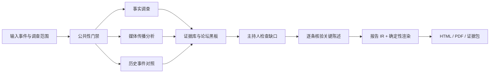

# 舆情专报 Agent

> 版本 0.3.0 · 公开预览版 · Apache-2.0

舆情专报 Agent 是一套可自部署的公开信息研究工具。输入事件名称和关注范围后，系统会组织多路调查、保存证据、逐条核验关键陈述，并生成能够回到来源核查的 HTML 专报。

项目面向研究者、媒体与传播从业者、学生，以及需要核验公开信息的个人用户。它强调证据可追溯和结论边界，不替代记者、研究人员或事实核查人员的专业判断。

## 为什么使用它

- **结论可回查**：重要陈述绑定证据，报告中的引用可以回到原文链接或清洗后的本地快照。
- **核验过程可见**：关键陈述按“已证实、待核验、争议、已证伪”标记，并展示来源与核验依据。
- **调查过程可恢复**：分析事件通过 SSE 实时呈现；任务可以暂停、续跑，或提前停止并基于已有材料生成报告。
- **模型与搜索服务可替换**：七个 LLM 角色支持 OpenAI-compatible 接口；搜索支持 LangSearch、智谱、百度千帆、Tavily 和 Serper，并按顺序降级。
- **报告可带走**：输出速览版和完整版 HTML，也可导出 PDF 与包含清洗证据快照的 ZIP 证据包。
- **数据边界明确**：默认只处理公开材料；图表只统计本次证据库，不用搜索结果数冒充真实声量。
- **面向决策阅读**：完整版把核心事实、条件性分析、行动建议与审计记录分层呈现。来源披露数字保留原话和口径，核验过程与完整证据默认折叠；分析不足时明确标为证据简报。

## 工作流程



快速模式只运行事实调查；标准和深入模式会启用三路调查。系统先保存证据，再允许陈述引用证据；报告 Agent 负责组织表达，徽章、正文、引用卡片等权威字段由程序从数据库回填。

报告阶段按传播、议题、历史对照和行动建议分章生成，再做分析语义审查与确定性引用/数字检查。它会增加模型调用；上游不可用或预算不足时保留可回查的证据简报，不用模板填充成完整分析。图表选择、数据条件与验收边界见 [报告质量与验收](docs/报告质量与验收.md)。

## 适用范围

适合：

- 围绕公共事件整理时间线、关键事实和争议点；
- 比较中文与英文公开信源；
- 为研究、采编或课程项目制作带来源的初步专报；
- 在本地保留报告、结构化证据和已清洗快照。

不适合：

- 针对可识别普通个人、未成年人或私人指控开展调查；
- 代替商业舆情平台进行全网实时监控或总体民意测量；
- 在无人复核的情况下作出事实裁决、风险决策或公开指控；
- 预测舆情走势，或输出没有可靠样本基础的情感百分比。

## 快速开始

运行一次完整任务至少需要：

- 一组 OpenAI-compatible 模型配置；
- 一个搜索 Provider 的 API Key；
- Docker，或 Python 3.11+ 与 Node.js 20+。

### Docker 演示模式

这是体验核心流程最短的路径：

```powershell
Copy-Item .env.example .env
# 编辑 .env，至少填写 DEFAULT_API_KEY 和一个搜索 API Key
docker compose -f compose.demo.yml up --build -d
```

打开 <http://127.0.0.1:8080>。

演示模式按浏览器会话限制任务数量和并发，禁止在线修改密钥，定期清理报告，并强制关闭登录态评论插件。停止服务：

```powershell
docker compose -f compose.demo.yml down
```

### 本地运行（Windows PowerShell）

本地模式支持设置页配置、任务历史和实验性评论插件：

```powershell
Copy-Item .env.example .env
# 编辑 .env，至少填写 DEFAULT_API_KEY 和一个搜索 API Key

cd backend
python -m venv .venv
.\.venv\Scripts\python.exe -m pip install -e ".[dev]"

cd frontend
npm ci
npm run build

cd backend
.\.venv\Scripts\python.exe -m uvicorn yuqing.app.main:app `
  --host 127.0.0.1 --port 8000 --reload

cd frontend
npm run dev
```

打开 <http://127.0.0.1:8000>。Linux 或 macOS 可使用同样的目录顺序，并将虚拟环境解释器路径替换为 `.venv/bin/python`。

开发前端时，在 `frontend/` 运行 `npm run dev`，访问 <http://127.0.0.1:5173>；Vite 会把 `/api` 代理到 8000 端口。

## 第一次使用

1. 打开配置中枢，检查模型角色与搜索 Provider；连接测试只有返回有效语义结果才算成功。
2. 输入公共事件名称，可补充时间范围、信源范围、语言和关注点。
3. 选择快速、标准或深入模式。模型与搜索调用会产生费用，建议先用快速模式熟悉流程。
4. 在调查席、论坛、证据台账和预算条中观察进度。任务中断后可从历史记录续跑。
5. 分析完成后查看速览版或完整版报告，并按核验状态筛选关键陈述。
6. 需要归档或复核时，下载 PDF 和证据包。

## 配置

复制 [`.env.example`](.env.example) 后，通常只需填写以下两类配置：

```dotenv
DEFAULT_API_KEY=your-model-key
DEFAULT_BASE_URL=https://api.example.com/v1
DEFAULT_MODEL=your-model

LANGSEARCH_API_KEY=your-search-key
SEARCH_PROVIDER_ORDER=langsearch,zhipu,qianfan,tavily,serper
```

七个模型角色分别是 `ANALYST_A`、`ANALYST_B`、`ANALYST_C`、`MODERATOR`、`VERIFIER`、`REPORTER` 和 `UTILITY`。某个角色需要独立模型时，使用 `LLM_<ROLE>_API_KEY`、`LLM_<ROLE>_BASE_URL`、`LLM_<ROLE>_MODEL` 覆盖默认值。

设置页写入本地 SQLite，优先级高于 `.env`，不会反写 `.env`；API 返回密钥时只提供脱敏值。完整变量、搜索服务和数据源说明见 [搜索与数据源配置指南](docs/方案包/04-搜索与数据源配置指南.md)。

连接诊断：

```powershell
cd backend
.\.venv\Scripts\python.exe -m yuqing.scripts.llm_ping analyst_a
.\.venv\Scripts\python.exe -m yuqing.scripts.llm_ping verifier
.\.venv\Scripts\python.exe -m yuqing.scripts.search_probe "测试事件" --fetch-first
```

LLM 探针必须得到 `reply=OK`；只有 HTTP 请求成功并不代表模型语义可用。

## 可选数据能力

系统默认通过公开网页检索完成调查，也可以导入有明确来源与使用权说明的历史数据：

```powershell
cd backend
.\.venv\Scripts\yuqing-import-dataset.exe --file .\events.jsonl `
  --slug public-events --name "公开舆情事件集" `
  --source-url "https://example.org/dataset" --license-label "CC-BY-4.0" `
  --rights-note "已核对再分发条件" --redistribution allowed
```

通用导入器支持 JSON、JSONL 和 CSV。配置 `YUQING_HOTLIST_URLS` 后，系统也可以定时采集 DailyHotApi 兼容源。只有本地数据实际覆盖目标事件时，报告才会使用相应的历史或热度信息。

### 实验性评论插件

本地模式可以显式开启 `YUQING_COMMENT_PLUGIN_ENABLED=true`，并为微博、哔哩哔哩、知乎、小红书、抖音、快手和百度贴吧保存独立浏览器登录态。该插件：

- 默认关闭，且在 Docker 与 Demo 模式中不可用；
- 只允许本机同源访问；
- 要求用户确认候选帖子后才采集评论；
- 只把评论作为已确认帖子的脱敏样本，不外推为平台或整体民意。

不同平台会调整页面结构和登录限制，发布前的自动测试不能替代真实账号逐平台验收。使用方法与风险边界见 [评论插件与国际信源使用指南](docs/V2-评论插件与国际信源使用指南.md)。

## 数据、安全与可信边界

- 系统生成的是带证据的研究草稿，不是事实裁决。真实事件仍需人工抽查来源、上下文和时效。
- 核验状态描述当前证据对陈述的支持关系，不代表来源永远正确，也不代表后续不会出现新证据。
- 报告中的数量和图表只反映本次证据库，不能解释为全网绝对声量或总体民意。
- 外文原文是核验依据；机器译文只帮助阅读。中文和英文具备完整检索流程，其他语言按可用信源尽力处理。
- 网页正文、评论和导入材料一律视为不受信数据，不能作为系统指令。内置抓取会拒绝本机和内网目标；公网生产环境仍应使用受控出口代理进一步降低 DNS rebinding 等风险。
- 公网部署需要 HTTPS、正式身份认证、访问控制、限流、监控和备份。`compose.demo.yml` 是受限演示配置，不是生产安全基线。
- 历史数据、热榜内容和评论的采集与再分发责任由部署者承担；请核对平台条款、数据许可、个人信息和所在地法律要求。

## 项目状态

当前版本为 **0.3.0 公开预览版**。

核心本地流程已实现，包括多 Agent 调查、证据与陈述存储、论坛协作、交叉核验、任务控制、报告 IR 校验与渲染、PDF 与证据包导出。评论插件属于实验性能力；真实登录、页面变动与账号风控需要部署者逐平台验证。公网生产部署也需要在演示配置之外自行完成安全加固。

## 文档导航

| 文档 | 适合读者 | 内容 |
| --- | --- | --- |
| [产品 SPEC](docs/方案包/01-产品SPEC.md) | 产品、研究与设计人员 | 产品目标、用户旅程、报告规格和合规边界 |
| [系统架构设计](docs/方案包/02-系统架构设计.md) | 开发者 | 分层、Agent 编排、事件协议、存储和故障恢复 |
| [核心契约](docs/方案包/05-核心契约.md) | 开发者与测试人员 | Agent、报告 IR、API 和核验规则 |
| [搜索与数据源配置指南](docs/方案包/04-搜索与数据源配置指南.md) | 部署者 | 模型、搜索服务、热榜和历史数据配置 |
| [评论插件与国际信源使用指南](docs/V2-评论插件与国际信源使用指南.md) | 本地高级用户 | 登录态评论采集、多语言与风险说明 |
| [实施路线图](docs/方案包/03-实施路线图.md) | 维护者 | 开发阶段、历史决策和后续工作 |

方案包形成于开发规划阶段，其中部分版本叙事和候选方案具有历史性质。判断当前已实现行为时，以代码、数据库约束和自动化测试为准；发现文档与实现不一致时，请提交 Issue。

## 开发与验证

```powershell
cd backend
.\.venv\Scripts\python.exe -m pytest
.\.venv\Scripts\ruff.exe check .
.\.venv\Scripts\ruff.exe format --check .
.\.venv\Scripts\lint-imports.exe

cd ..\frontend
npm test
npm run typecheck
npm run build
```

更具体的仓库结构、改动规则和验证要求见 [`AGENTS.md`](AGENTS.md)。

## 反馈与贡献

请通过本仓库的 Issue 提交缺陷、功能建议和一般问题。提交前请移除 API Key、登录 Cookie、个人信息、原始数据库和未脱敏评论。

安全漏洞不宜在公开 Issue 中披露。项目正式托管后仍需补充 `SECURITY.md` 与私密报告渠道；在该渠道建立前，请不要公开可被直接利用的细节。

## 许可证

本项目采用 [Apache License 2.0](LICENSE)。第三方数据、网页内容和用户导入材料不因本项目许可证而自动获得 Apache-2.0 授权，其使用仍受各自来源条款约束。
